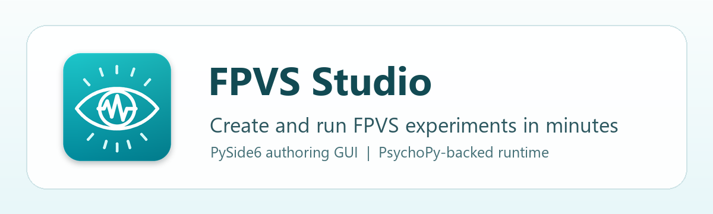

# FPVS Studio



FPVS Studio helps you create and run Fast Periodic Visual Stimulation experiments
without writing code. It gives you a guided setup workflow for projects, conditions,
stimulus images, fixation settings, and experiment launch.

The current beta package is designed for Windows and includes a desktop app, image
preparation tools, and a PsychoPy-backed presentation runtime.

## What You Can Do

- Create and reopen FPVS experiment projects.
- Add one or more experiment conditions.
- Import base and oddball image folders.
- Normalize images into FPVS-ready PNG copies.
- Create optional control conditions from existing stimuli.
- Configure session repeats, fixation cross behavior, and response tracking.
- Preview launch readiness before running.
- Launch fullscreen FPVS playback from the app.
- Use `Tools > Image Resizer` as a standalone image-preparation utility.

## Install FPVS Studio

Download the latest FPVS Studio installer from the GitHub Releases page.

Run the installer, then launch FPVS Studio from the Start Menu or Desktop shortcut.
You do not need to install Python or open the source code.

On first launch, FPVS Studio asks you to choose an **FPVS Studio Root Folder**. This
folder is where the app looks for your experiment projects and stores shared app-level
templates.

Suggested folder:

```text
Documents\FPVS Studio
```

## Create Your First Project

1. Open FPVS Studio.
2. Choose `Create New Project`.
3. Enter a project name.
4. Choose where the project folder should be created.
5. Follow the Setup Wizard from left to right.

The Setup Wizard walks through:

- `Project`: project name, description, and experiment template.
- `Conditions`: condition names, trigger codes, instructions, and image folders.
- `Experiment`: display refresh rate, background color, and repeats per condition.
- `Fixation`: fixation cross timing and target schedule.
- `Response`: optional fixation accuracy tracking.
- `Review`: final readiness summary before returning home.

## Prepare Images

Each condition needs:

- a base image folder
- an oddball image folder

When you leave the Conditions step, FPVS Studio checks the selected image folders. If
images need preparation, the app can create normalized PNG copies for you.

You can also use the standalone image utility:

```text
Tools > Image Resizer
```

The Image Resizer optimizes a chosen folder into FPVS-ready PNG images without changing
your current project.

## Run An Experiment

After setup is complete, return to Home and choose:

```text
Launch Experiment
```

Before playback starts, FPVS Studio checks the project and asks for a participant number.
Playback opens fullscreen and uses `Space` for start/continue prompts.

Run outputs are saved inside the project folder under:

```text
runs\
```

Project-level run history is stored under:

```text
logs\
```

## Reopen Existing Projects

Use:

```text
Open Projects
```

FPVS Studio lists projects found in your configured FPVS Studio Root Folder and recent
valid projects you have opened before.

## Manage Projects And Templates

Use the `File` menu to manage projects, change settings, and manage condition templates.
Custom condition templates are stored in your FPVS Studio Root Folder, so app updates do
not replace them.

## Updating FPVS Studio

Use `File > Check for Updates` inside FPVS Studio. FPVS Studio checks GitHub Releases,
shows the current and latest versions, and displays a short "What's New" summary when an
update is available. The app can download the installer, show progress, and restart into
the installer after you confirm. Updates replace the application files while leaving your
projects, settings, templates, run history, and logs outside the install folder.

## Current Beta Notes

FPVS Studio is currently a beta package. The app supports the guided authoring workflow,
image preparation, project saving/reopening, and fullscreen PsychoPy-backed playback.

The current launch path uses the app's beta runtime mode and keeps advanced display and
hardware-trigger controls hidden from the normal setup workflow.
